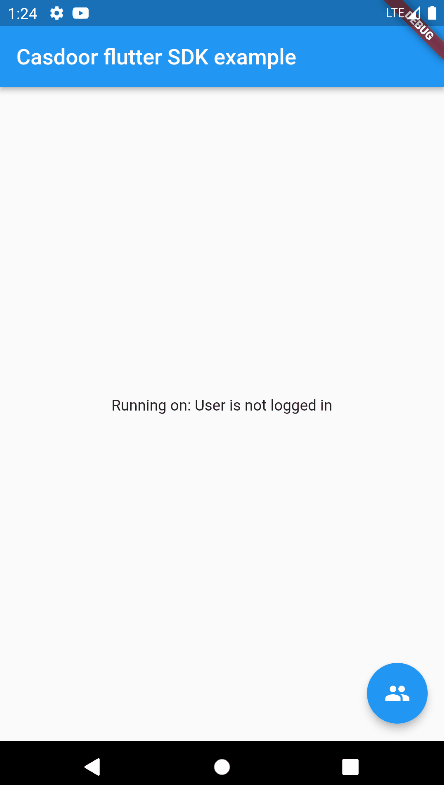
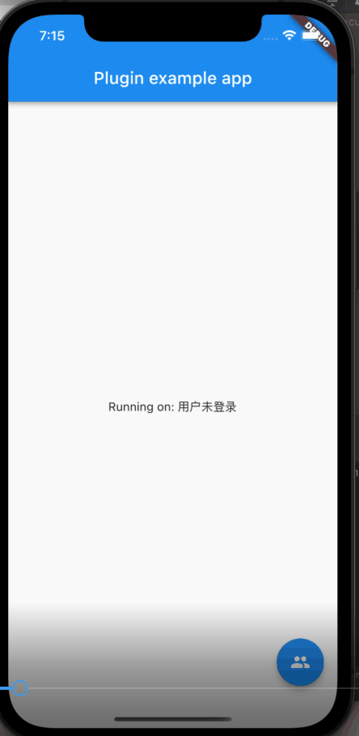
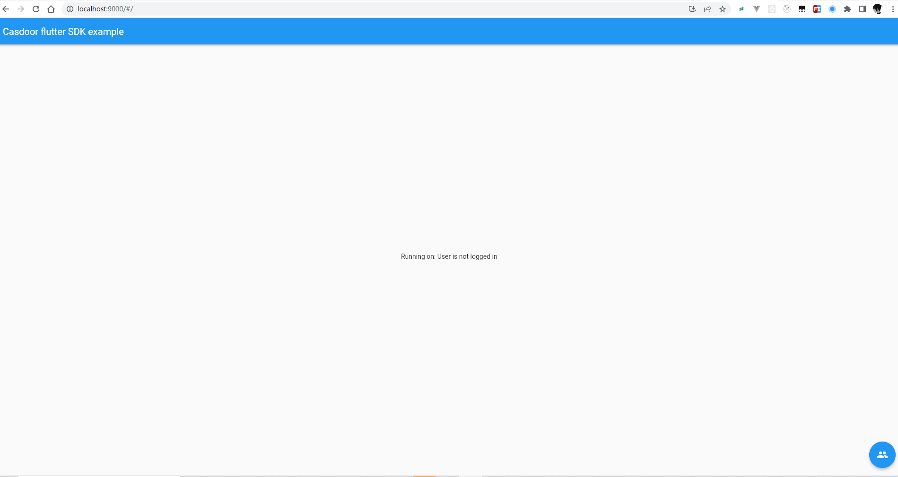

<h1 align="center" style="border-bottom: none;">📦⚡️Casdoor flutter example</h1>
<h3 align="center">An example of casdoor-flutter-sdk</h3>

## 	The example uses the following Casdoor demo site server:

The server: https://door.casdoor.com/

## Quick Start

- download the code

```bash
 git clone git@github.com:casdoor/casdoor-flutter-example.git
```

- install dependencies

```shell
 flutter pub get
```
## Configure
Initialization requires 6 parameters, which are all str type:
|  Name (in order)   | Must  | Description |
|  ----  | ----  |----  |
| clientId  | Yes | Application.client_id |
| serverUrl  | Yes | Casdoor Server Url, such as `https://door.casdoor.com` |
| organizationName  | Yes | Organization name |
| appName  | Yes | Application name |
| redirectUri  | Yes | URI of Web redirection |
| callbackUrlScheme  | Yes | URL Scheme |

```
  final AuthConfig _config =  AuthConfig(
      clientId: "014ae4bd048734ca2dea",
      serverUrl: "https://door.casdoor.com",
      organizationName: "casbin",
      appName: "app-casnode",
      redirectUri: "http://localhost:9000/callback.html",
      callbackUrlScheme: "casdoor"
  );
```

## Run

```
flutter run -d chrome --web-port 9000
```

## Note here that for Android and Web

### Android
In order to capture the callback url, the following activity needs to be added to your AndroidManifest.xml. Be sure to relpace YOUR_CALLBACK_URL_SCHEME_HERE with your actual callback url scheme.
```
 <activity android:name="com.example.casdoor_flutter_sdk.CallbackActivity"
           android:exported="true">
           <intent-filter android:label="casdoor_flutter_sdk">
               <action android:name="android.intent.action.VIEW" />
               <category android:name="android.intent.category.DEFAULT" />
               <category android:name="android.intent.category.BROWSABLE" />
               <data android:scheme="casdoor" />
           </intent-filter>
       </activity>
```

### Web
On the Web platform an endpoint needs to be created that captures the callback URL and sends it to the application using the JavaScript postMessage() method. In the ./web folder of the project, create an HTML file with the name e.g. callback.html with content:

```
<!DOCTYPE html>
<title>Authentication complete</title>
<p>Authentication is complete. If this does not happen automatically, please
close the window.
<script>
  window.opener.postMessage({
    'casdoor-auth': window.location.href
  }, window.location.origin);
  window.close();
</script>

```
Redirection URL passed to the authentication service must be the same as the URL on which the application is running (schema, host, port if necessary) and the path must point to created HTML file, /callback.html in this case, like  `callbackUri = "${_config.redirectUri}.html"`. The callbackUrlScheme parameter of the authenticate() method does not take into account, so it is possible to use a schema for native platforms in the code.It should be noted that when obtaining a token, cross domain may occur

For the Sign in with Apple in web_message response mode, postMessage from https://appleid.apple.com is also captured, and the authorization object is returned as a URL fragment encoded as a query string (for compatibility with other providers).

## After running, you will see the following  interfaces:
|  **Android**   | **iOS**  | **Web** |
|  ----  | ----  |----  |
|  |  | |

## Support WeChat third-party login on iOS.
The current SDK will display the scan code login after clicking the WeChat third-party login on the web page. It is obviously unreasonable to scan the code on the mobile end.

If you want to click the WeChat login button on the webpage on the iOS mobile terminal to invoke the WeChat native jump login, you need to refer to the [WeChat iOS access guide](https://developers.weixin.qq.com/doc/oplatform/Mobile_App/Access_Guide/iOS.html) to access the WechatOpenSDK-XCFramework of the WeChat SDK, and then untie the comments about the WeChat part in OcCasdoorFlutterSdkPlugin.m, in Fill in app_id and universal_link in the corresponding position.

Add `pod 'WechatOpenSDK-XCFramework'` command in example/iOS/Podfile and execute `pod install`. Then refer to the [WeChat iOS access guide](https://developers.weixin.qq.com/doc/oplatform/Mobile_App/Access_Guide/iOS.html) for related configurations.

