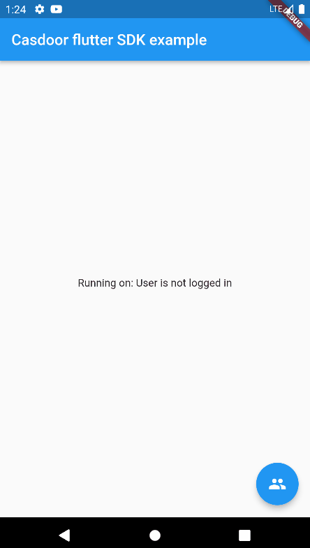
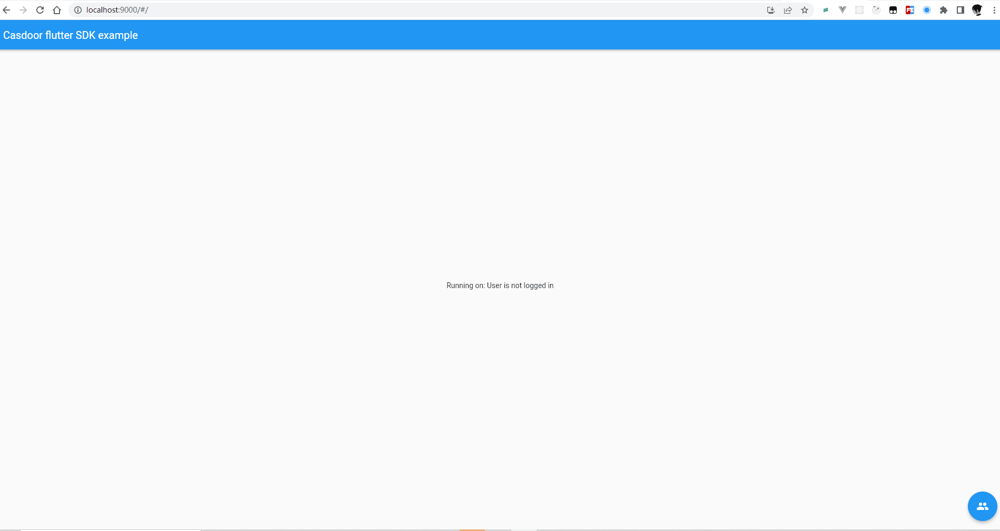

# Casdoor Flutter Example

[](https://github.com/casdoor/casdoor-flutter-example/actions/workflows/build.yml)
[](https://github.com/casdoor/casdoor-flutter-example/blob/master/LICENSE)
[](https://discord.gg/5rPsrAzK7S)

An example [Flutter](https://flutter.dev/) app (Android, iOS, macOS, Linux, Windows and the Web) that signs users in with [Casdoor](https://casdoor.ai/) using [casdoor-flutter-sdk](https://github.com/casdoor/casdoor-flutter-sdk).

| Android | iOS | Web |
|---------|-----|-----|
|  |  |  |

## How it works

All of it is in [lib/main.dart](lib/main.dart):

1. **Login** calls `casdoor.show()`. The SDK creates a PKCE code verifier, a nonce and a random state, and opens the Casdoor sign-in page: in the system browser on Android, iOS and macOS, in a web view window on Linux and Windows, in a popup on the Web.
2. After signing in, Casdoor redirects to the redirect URI (`casdoor://callback`, or `callback.html` on the Web) and the SDK returns that URL. The app checks the state with `casdoor.isState()`.
3. `casdoor.requestOauthAccessToken(code)` exchanges the code for the tokens with the code verifier, so no client secret is stored in the app.
4. The app shows the user from the access token (`casdoor.decodedToken()`) and keeps the tokens with shared_preferences. **Logout** ends the Casdoor session (`casdoor.tokenLogout()`).

## Prerequisites

- [Flutter](https://docs.flutter.dev/get-started/install) 3.24+
- A Casdoor server. The example is preconfigured for the public demo server https://door.casdoor.com, so it runs as is. To use your own, see [Casdoor installation](https://casdoor.ai/docs/basic/server-installation).

## Configuration

Skip this section to try the example with the public demo server.

In your Casdoor, create (or reuse) an organization and an application, and add `casdoor://callback` and `http://localhost:9000/callback.html` to the application's **Redirect URLs**. Then fill in `casdoorConfig` in [lib/main.dart](lib/main.dart):

```dart
final AuthConfig casdoorConfig = AuthConfig(
  clientId: '014ae4bd048734ca2dea', // client ID of the application
  serverUrl: 'https://door.casdoor.com', // Casdoor server URL
  organizationName: 'casbin', // organization of the application
  appName: 'app-casnode', // name of the application
  redirectUri:
      kIsWeb ? 'http://localhost:9000/callback.html' : 'casdoor://callback',
  callbackUrlScheme: 'casdoor',
);
```

If you change the scheme `casdoor`, change it in [android/app/src/main/AndroidManifest.xml](android/app/src/main/AndroidManifest.xml) too.

## Run

```shell
git clone https://github.com/casdoor/casdoor-flutter-example
cd casdoor-flutter-example
flutter pub get
```

| Platform        | Command                                 |
|-----------------|-----------------------------------------|
| Web             | `flutter run -d chrome --web-port 9000` |
| Android, iOS    | `flutter run`                           |
| Windows         | `flutter run -d windows`                |
| macOS           | `flutter run -d macos`                  |
| Linux           | `flutter run -d linux`                  |

Click **Login**. On the demo server, sign in with username `admin` and password `123`.

Platform notes, see the [platform setup of the SDK](https://github.com/casdoor/casdoor-flutter-sdk#platform-setup) for the details:

- **Web**: the port must be the one of the redirect URI. Casdoor redirects the popup to [web/callback.html](web/callback.html), which sends the URL back to the app.
- **Android**: `CallbackActivity` in `AndroidManifest.xml` receives `casdoor://callback`.
- **Linux**: install WebKitGTK, for example `sudo apt install libwebkit2gtk-4.1-dev`.
- **Windows**: needs the [WebView2 Runtime](https://developer.microsoft.com/microsoft-edge/webview2/), preinstalled on Windows 11.

## Resources

- [Casdoor documentation](https://casdoor.ai/docs/overview)
- [casdoor-flutter-sdk](https://github.com/casdoor/casdoor-flutter-sdk)

## License

[Apache-2.0](LICENSE)
